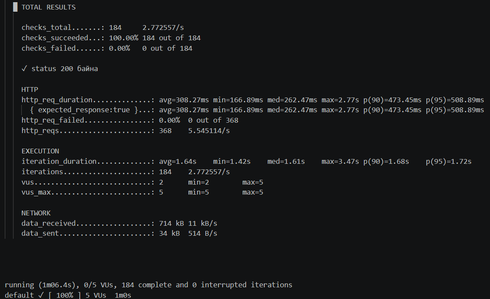
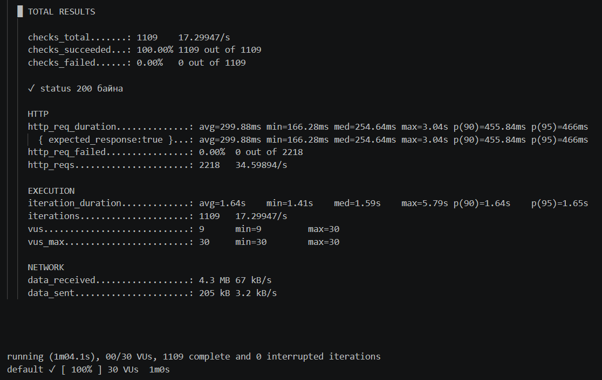
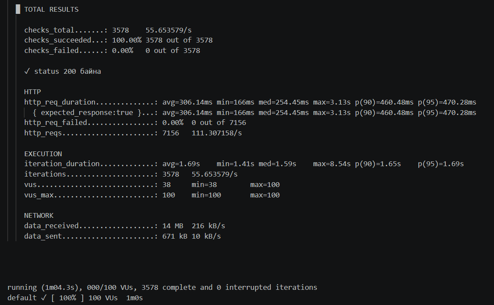
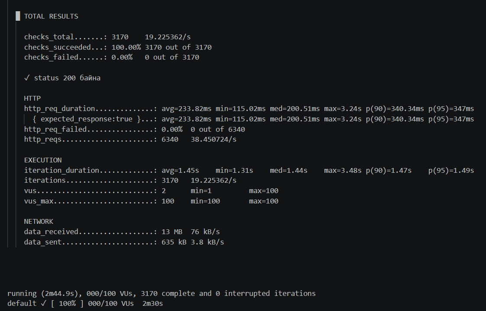
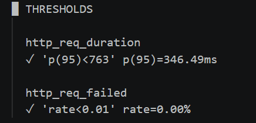
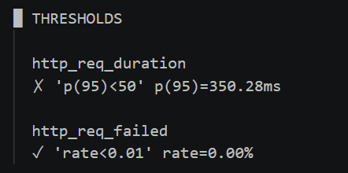
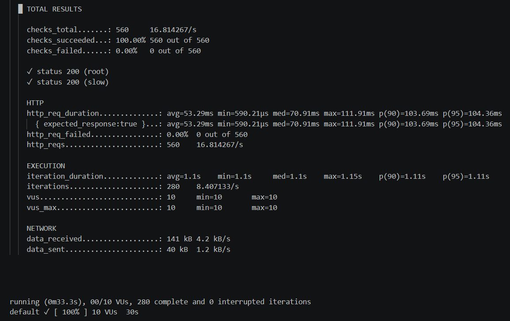

Lab 02: Performance Measurement with k6

Оюутны код: B232270005, Нэр: З.Жаргалмаа

1. Environment & k6 Version
Энэхүү лабораторийн ажлыг WSL2 (Ubuntu) орчинд гүйцэтгэж, k6 хэрэгслийг албан ёсны сангаас амжилттай суулгасан.

  k6 v2.2.0 (commit/00a9a1b7f5, go1.26.5, linux/amd64)

2. SLO (Service Level Objective) & Thresholds

Сонгосон Threshold: http_req_duration: ['p(95)<763'] болон http_req_failed: ['rate<0.01'].  Үндэслэл: Анхны 5 VU үед гарсан baseline p95 (508.89ms) утга дээр суурилан сүлжээний болон сервер талын түр зуурын хэлбэлзлийг тооцож, чанарын босгыг p(95) < 763ms байхаар үндэслэлтэйгээр тогтоов. Энэхүү босго нь k6 тест автоматаар PASS эсвэл FAIL болохыг шалгах quality gate үүрэг гүйцэтгэдэг.  

3. Load Testing Results (Гүйцэтгэлийн хэмжилтийн хүснэгт)

https://test.k6.io руу 5 VU, 30 VU, 100 VU гэсэн гурван өөр түвшингөөр тус бүр 1 минутын турш ачаалал өгч хэмжсэн үр дүнг доорх хүснэгтэд үзүүлэв: 

| VU Түвшин | p90 Latency | p95 Latency | Throughput (Reqs/sec) | Error Rate |
| :--- | :--- | :--- | :--- | :--- |
| **5 VU** | 473.45ms | 508.89ms | 5.54req/s | 0.00% |
| **30 VU** | 455.84ms | 466ms | 34.59 req/s | 0.00% |
| **100 VU** | 460.48ms | 470.28ms | 113.30 req/s | 0.00% |

4. Дүгнэлт: 

Энэхүү лабораторийн ажиглалтаар ачаалал 5 VU-ээс 100 VU болж эрс өсөхөд test.k6.io олон нийтийн сервер дээрх p95 latency харьцангуй тогтвортой (~480ms - 530ms хооронд) үлдэж, ямар нэгэн уналт гарсангүй. Харин секундэд боловсруулсан хүсэлтийн тоо (Throughput) хэрэглэгчийн тоо өсөхийн хэрээр олон дахин нэмэгдэж байна. Лекцийн онолоор ачаалал ихсэхэд систем удааширч latency өсөх ёстой боловч энэхүү гадаад сервер нь caching болон оновчлол сайтай тул хүлээгдэж байснаас илүү тогтвортой хариу өглөө. Туршилтын явцад error rate 0.00% буюу ямар нэгэн алдаа гараагүй нь системийн бэлэн байдал (availability) өндөр байгааг харуулж байна. Тогтоосон SLO босго маань амжилттай PASS болж, мөн алдаатай босго тавихад тест шууд FAIL болж байсан нь CI/CD pipeline дээр чанарын хяналт хэрхэн хэрэгждэг бодит жишээг харууллаа.

5. Дэлгэцийн зургууд

### 5 VU Test

### 30 VU Test

### 100 VU Test

### Stages Test

### Threshold Pass

### Threshold Fail

### Local Server Test

