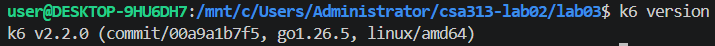
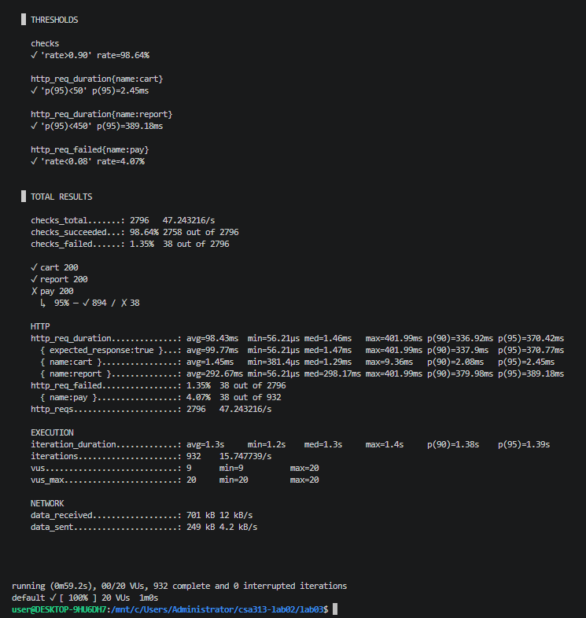
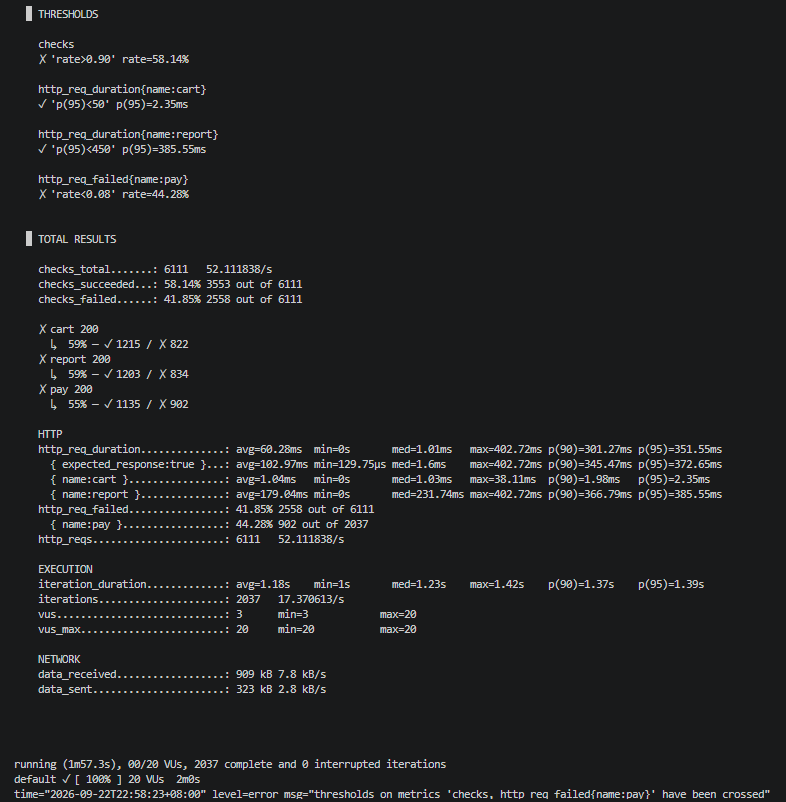
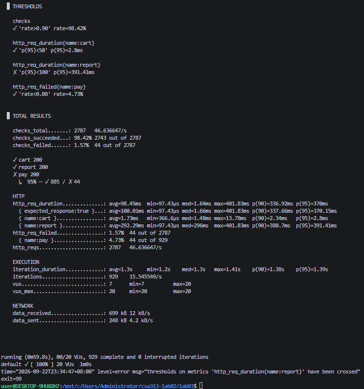

Оюутны код: B232270005, Нэр: З.Жаргалмаа

Lab 03: Quality Scenarios, SLOs, and k6 Thresholds

Энэхүү лабораторийн ажлаар бид өөрсдийн бүтээсэн локал Express API серверийн гүйцэтгэл (Performance), найдвартай байдал (Reliability), болон бэлэн байдлыг (Availability) үнэлэх чанарын сценариудыг зохиож, тэдгээрийг Service Level Objectives (SLO) болон k6 автомат босго (thresholds) болгон хөрвүүлэх туршиж байна.

1. Чанарын сценариудын тодорхойлолт 

### 1. Performance сценарио (/cart/add)
* **Тойм:** Сагсанд бараа нэмэх хурдан үйлдлийн үеийн гүйцэтгэл болон серверийн хариу өгөх хугацааг хэвийн ачааллын үед хэмжих.
* **Системийн төлөв:** API сервер тогтвортой ажиллаж байна, нөөцийн ашиглалт хэвийн түвшинд байна.
* **Орчны төлөв:** Локал хөгжүүлэлтийн орчин (`http://localhost:3000`), сүлжээний саатал байхгүй.
* **Гадаад өдөөлт:** 20 Virtual Users (VU) тогтмол ачаалалтайгаар 1 минутын турш `/cart/add` руу тасралтгүй хүсэлт илгээх
* **Шаардлагатай хариу:** Хүсэлтүүд ямар нэгэн хүлээлтгүйгээр амжилттай боловсруулагдаж, `{ ok: true, items: 1 }` гэсэн хариуг хоцрогдол багатайгаар буцаана.
* **Хэмжүүр:** $p95$ хариу өгөх хугацаа

### 2. Reliability сценарио (/pay)
* **Тойм:** Төлбөр хийх үйл явц дээр үүсэх санамсаргүй алдааны давтамжийг хянаж, найдвартай байдлын түвшнийг үнэлэх.
* **Системийн төлөв:** Сервер хэвийн ажиллаж байгаа боловч кодын логик ёсоор хүсэлтийн ойролцоогоор 5%-д нь 500 алдаа (gateway timeout) буцаах төлөвтэй байна.
* **Орчны төлөв:** Локал орчин, хэвийн сүлжээний урсгал.
* **Гадаад өдөөлт:** 20 VU ашиглан 1 минутын турш `/pay` endpoint руу төлбөрийн хүсэлтүүдийг илгээх
* **Шаардлагатай хариу:** Систем түр зуурын алдааг зөв бүртгэж, алдааны хувь хэмжээг урьдчилан тогтоосон хязгаар дотор барих.
* **Хэмжүүр:** Алдааны түвшин (Error rate / POFOD)

### 3. Availability сценарио (Серверийн уналт ба сэргэлт)
* **Тойм:** Сервер гэнэт унаж (crash) зогссоны дараа дахин асаахад системийн бэлэн байдал болон сэргэх чадвар хэрхэн хангагдаж байгааг шалгах.
* **Системийн төлөв:** Node.js сервер хэвийн ажиллаж байгаад гэнэт зогссон (Process terminated).
* **Орчны төлөв:** Локал серверийн орчин.
* **Гадаад өдөөлт:** 2 минутын туршилтын хугацаанд 10 секундын серверийн зогсолт (crash/downtime) оруулах
* **Шаардлагатай хариу:** Сервер сэргэж ассан даруйдаа шинээр ирж буй хүсэлтүүдийг алдаагүйгээр хүлээн авч үйлчилж эхлэх.
* **Хэмжүүр:** Бэлэн байдлын хувь (Availability %) болон сэргэх хугацаа.

2. Сценарио бүрээс SLO гаргах ба Босго утгууд

### SLO Үндсэн Хүснэгт

| Сценарио | SLI (Юуг хэмжих) | Босго (Threshold / SLO) | Цонх / нөхцөл |
| :--- | :--- | :--- | :--- |
| **Performance (Cart)** | `/cart/add` latency | p95 < 50 ms | 20 VU тогтмол ачаалал, 1 мин |
| **Performance (Report)** | `/report` latency | p95 < 450 ms | 20 VU тогтмол ачаалал, 1 мин |
| **Reliability** | `/pay` error rate | < 8% | 1 мин, 20 VU |
| **Availability** | Бүх хүсэлтийн амжилтын хувь | >= 90% | 2 мин, 10с зогсолт орсон |

## Сценарийн 6 хэсэгтэй Хүснэгт (SLO & Thresholds)

| Сценарио | SLI (Хэмжих зүйл) | Босго (Threshold / SLO) | Хэмжих цонх (Window) | Босго тогтоосон үндэслэл | Error Budget / Тооцоо |
| :--- | :--- | :--- | :--- | :--- | :--- |
| **1. Performance (Cart)** | `/cart/add` latency | `p(95) < 50ms` | 20 VU, 1 мин | Локал орчинд маш хөнгөн ажилладаг тул хэт сул босго байлгахгүйн тулд бодитоор чангатгав. | Нийт хүсэлтийн 95%-д нь 50ms-ээс хэтрэхгүй байх (Зөвшөөрөгдөх хугацааны хязгаар). |
| **2. Performance (Report)** | `/report` latency (Нэмэлт) | `p(95) < 450ms` | 20 VU, 1 мин | Санамсаргүй байдлаар 200–400ms хүлээлт үүсгэдэг тул бодит хэмжилтэд суурилан тогтоов. | Хүлээгдэж буй хугацаанаас хэтрэхгүй байх бөгөөд 95% найдвартай байх. |
| **3. Reliability (Pay)** | `/pay` error rate | `rate < 0.08` | 1 мин, 20 VU | Код дотор зориудаар 5% алдаа суулгасныг харгалзан сүлжээний хэлбэлзлийг тооцож тогтоов. | Зөвшөөрөгдөх алдааны төсөв (Error Budget) нь хамгийн ихдээ 8%-ийн алдааг хүлээн зөвшөөрөх. |

### Босго утгыг сонгосон үндэслэл (Rationale)

1. **Performance босго (/cart/add - $p95 < 50\text{ms}$):** Энэ нь маш хөнгөн endpoint бөгөөд бодит тестээр $p95$ нь ~2.8ms гарч байсан
 Иймд 200ms гэдэг нь хэт сул босго тул утгыг нь 50ms болгон бодитойгоор чангатгасан
2. **Performance босго (/report - $p95 < 450\text{ms}$):** Энэ endpoint нь санамсаргүй байдлаар 200-400ms хүлээлт (`sleep`) үүсгэдэг тул бодит хэмжилтэд үндэслэн $p95$ босгыг 450ms байхаар дөрөв дэх сценарио болгон нэмсэн
3. **Reliability босго ($< 8\%$):** Код дотор 5% алдаа суулгасныг харгалзан сүлжээний бага зэргийн хэлбэлзлийг тооцон 8% гэж тогтоосон
4. **Availability босго ($\ge 90\%$) ба Error Budget:** 2 минутын туршилтад 10 секундын зогсолт тооцож, 12 секундын "эвдрэх эрх"-ийг үндэслэн 90%-ийн босго тавьсан

3. Chaos тестийн үр дүн ба Дүгнэлт

### 1. Chaos тестийн бодит үр дүн
* **Availability threshold (`checks`):** Серверийг 2 минутын туршилт дунд 10 секунд зориудаар унагааж сэргээхэд бэлэн байдлын хувь **58.14%** болж буурч, босго (`> 90%`) **FAIL** болсон.
* **Reliability threshold (`/pay` error rate):** Сервер унасан үед хүсэлтүүд унасны улмаас алдааны хувь **44.28%** болж өсөн, босго (`< 8%`) **FAIL** болсон.

### 2. Цаг болон Хүсэлтийн зөрүүгийн тайлбар (Error Budget)
k6-ийн checks нь хугацааны (цагийн) буюу үргэлжлэх хугацааны хувь биш, харин **хүсэлтийн (requests)** хувь юм. Сервер унасан үед хэвийн үеийнх шиг `/report`-ын 200-400 мс хүлээлт байхгүй, хүсэлтүүд connection refused хэлбэрээр агшин зуур буцдаг учир зогсолтын 1 секундэд хэвийн үеийнхээс хамааoл олон хүсэлт "идэгддэг". Тиймээс цагаар тооцсон 12 секундийн error budget нь хүсэлтээр тооцоход илүү өндөр алдааг үүсгэж зөрүүтэй гарч байна.

### 3. SLI тусгаарлалт ба Дүгнэлт
Нэг удаагийн серверийн уналт (crash) нь Availability болон Reliability (`/pay`) гэсэн хоёр өөр SLO-г зэрэг зөрчиж байна. Үүнийг цаашид тусгаарлахын тулд **Availability SLI** нь дэд бүтцийн түвшний бэлэн байдлыг (сервер асаалттай эсэх), харин **Reliability SLI** нь бизнесийн логикийн түвшний алдааг (сервер ажиллаж байхад төлбөр амжилтгүй болох) тус тус ангилан хэмжих шаардлагатай.

4. Threshold-ийг зориуд эвдэх (Fail Scenario) ба CI/CD Exit Code

### 1. Туршилтын зорилго
Системийн хяналтын босго (threshold) алдааг илрүүлж чадаж байгаа эсэх, мөн автоматжуулсан суваг (CI/CD pipeline) дээр шалгуур зөрчигдөхөд build-ийг хэрхэн зогсоодог механикыг шалгах зорилгоор `/report` endpoint-ийн хурдны босгыг хэт хатуу буюу `p(95) < 100` болгон өөрчилж туршсан.

### 2. Үр дүн ба Дүгнэлт

### А. Fail Тестийн Үр Дүн
* **`/cart/add` ($p95 = 2.8\text{ms}$):** Локал орчинд маш хөнгөн ажилладаг тул `p(95) < 50` босгыг **PASS** хэвээр хангасан.
* **`/report` ($p95 = 391.41\text{ms}$):** Серверийн логик ёсоор санамсаргүй хүлээлт (`sleep`) үүсгэдэг тул `p(95) < 100` босгыг давж чадалгүй **FAIL** болсон.
* **Exit Code (`exit=99`):** k6 тест дээр threshold зөрчигдөхөд `0`-ээс ялгаатай code буцаасан ба үүнийг `PIPESTATUS[0]` ашиглан амжилттай шүүж авсан. 

### Б. Pass Тестийн Үр Дүн
* **`/cart/add` ($p95 = 2.45\text{ms}$):** Локал орчинд маш хөнгөн ажилладаг тул $p(95) < 50$ босгыг амжилттай хангаж **PASS** болсон
* **`/report` ($p95 = 389.18\text{ms}$):** Тогтоосон $p(95) < 450$ босгын хязгаарт багтаж амжилттай **PASS** болсон
* **`/pay` (`rate=4.07%`):** Алдааны хувь нь тогтоосон босго болох `rate < 0.08` (буюу 8%)-аас бага гарч амжилттай **PASS** болсон
* **`Checks` (`rate=98.64%`):** Нийт шалгуур үзүүлэлтүүдийн 98.64% нь амжилттай биелж, босго шаардлагыг хангасан
* **`Exit Code` (`exit=0`):** Бүх threshold-ууд амжилттай биелсэн тул k6 тест амжилттай өндөрлөж, хэвийн кодыг буцаасан

### В. Chaos Тестийн Үр Дүн
* **Chaos Availability:** Нийт хүсэлтийн гүйцэтгэлээс тооцоолоход $\frac{3553}{6111} \approx 58.14\%$ амжилттай буюу бэлэн байдалтай ажилласан.
* **`Checks` (`rate=58.14%`):** Системд гэнэтийн ачаалал/саатал үүсгэхэд `rate > 0.90` босгыг хангаж чадалгүй (`X`) зөрчигдөж, нийт шалгуур үзүүлэлтүүдийн 58.14% нь л амжилттай биелсэн
* **`/cart/add` ($p95 = 2.35\text{ms}$):** Chaos тестийн үед ч мөн маш хөнгөн ажиллаж, $p(95) < 50$ босгыг амжилттай хангаж **PASS** болсон
* **`/report` ($p95 = 385.55\text{ms}$):** Тогтоосон $p(95) < 450$ босгын хязгаарт амжилттай багтаж **PASS** болсон
* **`/pay` (`rate=44.28%`):** Гэнэтийн ачааллын улмаас алдааны хувь өсөж, тогтоосон `rate < 0.08` босгыг давж чадалгүй амжилтгүй (**FAIL**) болсон
* **Exit Code (`exit=non-zero`):** `checks` болон `http_req_failed{name:pay}` метрикүүдийн босго утга зөрчигдсөн тул k6 тест алдааны мэдэгдэл гаргаж өндөрлөсөн

### 3. CI/CD Pipeline-д үзүүлэх нөлөө
Энэхүү `non-zero exit code` (тухайлбал `exit=99`) нь GitHub Actions болон бусад CI/CD хэрэгслүүдэд тестийн алдаа гарсан дохиог өгч, програм хангамжийн суллах хувилбар (deployment/build)-ыг автоматаар тасалж зогсооход ашиглагддаг чухал үүрэгтэй юм.

5. Дүгнэлт

Сценариос SLO руу шилжиж, улмаар код дээр хатуу threshold босго тогтоох явцад системийн бодит хязгаар болон хүлээгдэж буй гүйцэтгэлийг хооронд нь зөрүүлэхгүй байх нь энэхүү лабораторийн хамгийн чухал сорилт байлаа. Тухайлбал, /report endpoint-ийн хугацааны санамсаргүй хүлээлт нь стандарт босго тогтооход нарийн дүн шинжилгээ хийх шаардлагыг бий болгосон юм. Туршилтын явцад хийсэн мини Chaos туршилт нь манай availability болон reliability сценарийн хэмжүүрийг бодитоор баталж өгсөн бөгөөд сервер гэнэт унахад Error Budget хэрхэн агшин зуур шатаж, хяналтын систем (thresholds) алдааг шуурхай илрүүлж буйг харууллаа. Мөн k6 тест дээр гарсан non-zero exit code нь орчин үеийн CI/CD pipeline дээр бүтээгдэхүүний чанар болон бэлэн байдлыг автоматаар шалгаж, алдаатай хувилбарыг цаг тухайд нь зогсооход ямар амин чухал үүрэгтэй болохыг бүрэн ойлгож ухаарлаа. Энэхүү ажлаар дамжуularа бид системийн найдвартай байдлыг код түвшинд хэрхэн автоматжуулан хянах арга зүйд суралцсан нь цаашид бодит төслүүдэд ашиглахад үнэтэй туршлага боллоо.Энэхүү лабораторийн ажлын хүрээнд бизнесийн шаардлага буюу сценариос эхлэн Service Level Objective (SLO) руу шилжиж, улмаар код дээр хатуу threshold босго тогтоох цогц процесс хийж гүйцэтгэлээ. Туршилтын явцад системийн бодит хязгаар болон хүлээгдэж буй гүйцэтгэлийг хооронд нь зөрүүлэхгүй байх нь хөгжүүлэлтийн явцад тулгарах хамгийн чухал сорилт болохыг бид биеэр мэдэрсэн бөгөөд тухайлбал /report endpoint-ийн хугацааны санамсаргүй хүлээлт нь стандарт босго тогтооход нарийн дүн шинжилгээ хийх шаардлагыг бий болгосон юм. Туршилтын үеэр гүйцэтгэсэн мини Chaos туршилт нь манай систем дэх availability болон reliability сценарийн хэмжүүрийг бодит нөхцөлд туршиж баталгаажуулсан бөгөөд сервер гэнэт сааталд ороход Error Budget агшин зуур шатаж, хяналтын систем алдааг шуурхай илрүүлж буйг тод харууллаа. Мөн k6 ачааллын тест дээр гарсан 3553/6111 буюу 58.14%-ийн Chaos availability үзүүлэлт нь гэнэтийн ачааллын үеийн системийн тэсвэрлэх чадварыг тоон утгаар бодитоор илтгэсэн юм. k6 тест дээр threshold зөрчигдөхөд үүсдэг non-zero exit code нь орчин үеийн CI/CD pipeline дээр бүтээгдэхүүний чанар болон бэлэн байдлыг автоматаар шалгаж, алдаатай хувилбарыг production орчинд хүрэхээс өмнө цаг тухайд нь зогсооход амин чухал үүрэгтэй болохыг бүрэн ухаарлаа. Энэхүү ажлаар дамжуулан системийн найдвартай байдлыг код түвшинд хэрхэн автоматжуулан хянах, хэмжих арга зүйлд суралцлаа.